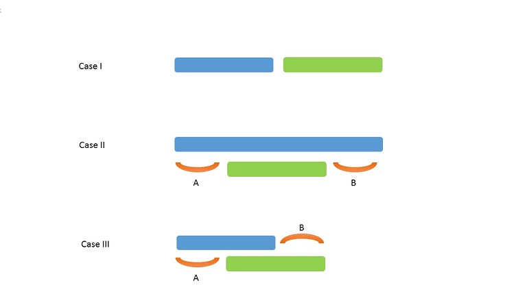

# leetcode解题思路
## 435(Non overlapping Intervals)
### Brute Force
将Intervals按start point从小到大排序，然后从左到右处理Interval，
针对每个Interval，有两种情况，属于最终的Interval或者不属于，对这
两种情况分别讨论，选择最小移除数的那种情况。处理完一个，再处理下一个。

复杂度O(2^n)，会超时。

### 贪心算法
也是先排序，从小到大处理每个Interval。针对某个Interval，和下一个Interval有如图三种关系：



很显然，前两种情况是保留第一个Interval。主要是看最后一种情况。
蓝色的Interval对后续选择的只是相交的那一段，而绿色Interval还包
含后一段，也就是说与前者相交的Interval也必然与后者相交，这种情
况下自然要选择前者。

## 406(Queue Reconstruction by Height)
### 问题重述
现有一个未知序列$$q = {a_1, a_2, ..., a_n}$$，数字$$a_n$$的顺序未知，
但已知它的数值以及排在它前面比它大(或者等于)的数字的个数，通过这些已知信息求出原来
的序列q。

输入$$r = {<x_1, c_1>, <x_2, c_2>, ..., <x_n, c_n>}$$，$$x_n$$是q中的数字，$$c_n$$是在$$x_n$$前面并且比它大的数字的个数。求出q。

### 思路
最开始有n个空位置，每次从剩余的数字中挑出最小的给它安排位置。因为每个空位
都将排比它大的数，因此从左到右数够空位个数即可得到该数字在q中的原始位置。

### 代码
```cpp
class Solution {
public:
    static bool cmp(pair<int, int> &a, pair<int, int> &b) {
        if(a.first < b.first) return true;
        else if(a.first > b.first) return false;
        //当大小一样的时候，个数大的排在前面，因为这样在数个数的时候可以把
        //和它相等的数字算进去，后面的代码就简单一些
        else return a.second > b.second;
    }
public:
    vector<pair<int, int>> reconstructQueue(vector<pair<int, int>>& people) {
        sort(people.begin(), people.end(), cmp);
        vector<int> index(people.size(), -1);
        for(int i = 0; i < people.size(); i++) {
            int cnt = 0;
            for(int j = 0; j < people.size(); j++) {
                //个数够了，但不要取已占用的位置  
                if(cnt == people[i].second && index[j] < 0) {
                    index[j] = i;
                    break;
                }
                //对空位置计数
                if(index[j] < 0) cnt++;
            }
        }
        vector<pair<int, int>> ret(people.size());
        //恢复原始顺序 
        for(int i = 0;i < ret.size(); i++) {
            ret[i] = people[index[i]];
        }
        return ret;
    }
};
```

## 392(Is Subsequence)
### 问题重述
一个短字符串s(<=100)和一个长字符串t(~=50,000)，判断s是否是t的子串，也就是说是否可以通过剔除
s中的某些字符得到t。

### 思路
将s和t从右向左对齐，对于s中最右边未对齐的字符s[i]，在t中找到右边第一个与s[i]相等的字符t[j]。
其中的逻辑在于：假设存在t[q] == s[i]且q < j使得t和s剩余的部分完全对齐，那么把q改成j仍然是
后t和s仍然是对齐的。也就是说每次找最右边的相等字符对齐是整个对齐的必要条件。

### 代码

```cpp
class Solution {
public:
    bool isSubsequence(string s, string t) {
        int k = t.size() - 1;
        for(int i = s.size() - 1; i >= 0; i--) {
            for(;k >= 0 && t[k] != s[i];k--);
            if(k >= 0) k--;
            else return false;
        }
        return true;
    }
};
```
