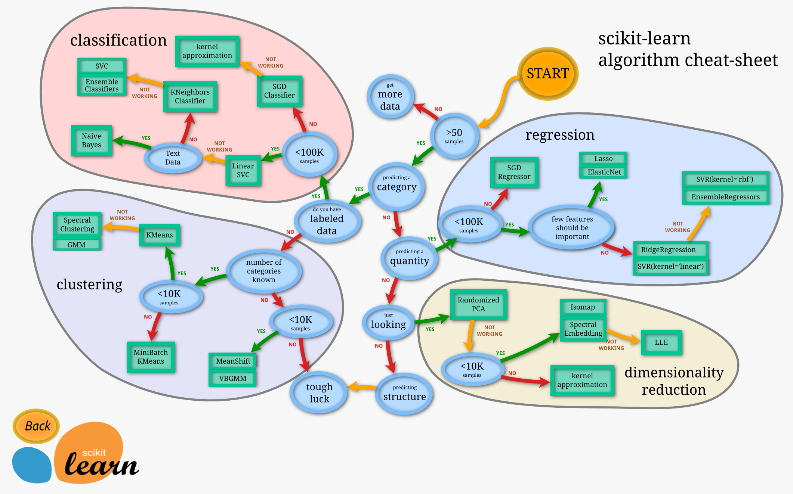

> 2017-03-21 杭州 阴

# python机器学习
使用python来做机器学习相关的项目或者比赛，主要是学习两个包，scikit-learn和pandas，前者集成了各种常用的机器学习模型和算法，并提供了统一的使用接口；后者提供了处理体量较大的数据，使用类似于SQL的语法来查询更改数据。下面分别对两者做些简单的介绍。

## scikit-learn
以使用线性回归算法为例

```python
    from sklearn.linear_model import LinearRegression
    X = [[0], [1], [2], [4]]
    y = [0, 1, 2, 4]
    reg = LinearRegression()
    # 训练
    reg.fit(X, y)
    # 预测
    print(reg.predict([[5], [7]]))
    # 预测结果是[ 5.  7.]
```

sklearn中的模型基本上都遵循这个模式，先创建一个模型对象，然后调用fit方法训练模型，
最后使用predict方法做预测。更多模型的细节可参考官方的[API文档](http://scikit-learn.org/stable/modules/classes.html)。

### 保存、加载训练好的模型
使用sklearn中的joblib这个包，使用方法比较简单。
```python
    from sklearn.externals import joblib
    #将训练好的模型对象reg保存到文件linear_regression.pkl中_
    joblib.dump(reg, 'linear_regression.pkl')
    #...
    #从磁盘中加载模型
    reg = joblib.load('linear_regression.pkl')
```

值得提出的一点是joblib主要的功能是序列化python对象，所以除了保存和加载模型外，
还可以保存、加载其他的python对象，比如DataFrame对象。官方推荐使用joblib来代替python自带的
pickle包，因为前者在处理体量更大的数据时更加高效。

### 评价模型
使用sklearn.metrics包，用法比较简单，具体的可参考官方文档。下面
罗列了一些常见的metrics。

- Mean squared error, [metrics.mean_squared_error](http://scikit-learn.org/stable/modules/generated/sklearn.metrics.mean_squared_error.html#sklearn.metrics.mean_squared_error)。定义如下:
    
    ![mse][mse_fmt]
- accuracy, [metrics.accuracy_score](http://scikit-learn.org/stable/modules/generated/sklearn.metrics.accuracy_score.html#sklearn.metrics.accuracy_score)。**注意仅**用于评估分类问题。定义如下：
    
    ![acc_fmt][acc_fmt]
- f1, [metrics.f1_score](http://scikit-learn.org/stable/modules/generated/sklearn.metrics.f1_score.html#sklearn.metrics.f1_score)
- logistic loss(也称cross-entropy loss), [metrics.log_loss](http://scikit-learn.org/stable/modules/generated/sklearn.metrics.log_loss.html#sklearn.metrics.log_loss)


### 交叉验证
使用sklearn.model_selection包，使用方法也比较简单。

```python
    def official_loss(estimator, X, y):
        '''官方定义的loss函数'''
        #注意重置index，不然会出现意想不到的问题
        y_ = y.reset_index(drop=True)
        y_p = estimator.predict(X)
        adds = (y_p + y_).abs()
        subs = (y_p - y_).abs()
        divs = subs / adds
        N = divs.shape[0] * divs.shape[1]
        return divs.sum().sum() / N

    #注意n_jobs使用多CPU时，不可以调试，否则会抛出异常
    scores = cross_val_score(model, feature, label, 
                                cv=KFold(n_splits=3, shuffle=False), 
                                #n_jobs=-1, 
                                scoring=official_loss
                                )
```

上面的代码把数据划分为3份，总共做三次验证操作，每次用一份数据作为验证集，得到3个对应的score并返回。

model就是一个模型对象，可以是LinearRegression，也可以是LogisticRegression。
feature和label分别是用于交叉验证的样本和标签，cv的[KFold](http://scikit-learn.org/stable/modules/generated/sklearn.model_selection.KFold.html#sklearn.model_selection.KFold.split)
对象就是用于将feature和label划分成均等的n_splits份，shuffle为True表示在划分数据前先打乱数据的顺序，默认
False。scoring参数使用哪种指标来评价模型，可以传入sklearn内置的指标(字符串)，也可以传入一个自定义的函数，
自定义函数的格式参考上面的代码。常见的scoring函数有下面几个，和上面的metrics也是对应的。

- 'accuracy'
- 'f1'
- 'neg_log_loss'
- 'neg_mean_squared_error'

**注意** 如果model属于自定义的模型类，该类要继承BaseEstimator并重写get_params方法，在这方法里返回相关的
模型参数(包括自定义的参数)。因为在cross_val_score函数内部，会根据model对象生成多个同类对象用于交叉验证过
程中训练数据，而这种根据对象生成另一个对象的过程会调用对象的get_params方法。

### 其他问题
#### 选择模型的经验规则


<center>sklearn官方给的经验规则</center>

#### class imbalance problem
当训练数据集中正样本太少时，可采取一些数据处理方法。python中可使用[SMOTE](http://contrib.scikit-learn.org/imbalanced-learn/generated/imblearn.over_sampling.SMOTE.html)
模块。安装SMOTE可用*conda install -c glemaitre imbalanced-learn*
或者 *pip install -U imbalanced-learn*。使用方法参考下面的代码。

```python
    from imblearn.over_sampling import SMOTE
    sm = SMOTE()
    #转换原始数据，使得正负样本数量均衡
    X_res, y_res = sm.fit_sample(X, y)
```

#### 一些细节问题
1. 在sklearn中，除非特别说明，传给模型的训练数据都会默认转换为float64类型。
Regression的targets默认转换为float64类型，而classification的targets的对象类型
默认保持不变。
2. 每次调用模型的fit函数，会自动清空之前训练好的参数。

## pandas
处理数据的核心类是DataFrame，可以把它简单地看成一张二维数据表，有index(行索引)和columns
(列索引)，大部分操作都是通过index和columns进行的。需要注意的一点是这里的index和columns
除了是数字以外，还可以是其他数据类型，和数据库中的表格一样，一般会给columns中的每一列取一个
有意义的名字，便于后续的操作。

**注意** 在有些操作中，如果两个表的除了index不一样，其他条件都满足，操作的结果可能和直观的
预期不一样，比如将某一列数据insert另一个DataFrame中，如果两者的index不一样，最终的DataFrame
的index是只有后者的index，那么前者没有的index值对应的数据就会出现NaN。类似的操作还有矩阵的
加减乘除操作。针对这种情况，可调用DF的[reset_index](http://pandas.pydata.org/pandas-docs/stable/generated/pandas.DataFrame.reset_index.html#pandas.DataFrame.reset_index)方法。
下面的代码说明了这种情况。

```python
    x = pd.DataFrame({'val':[1,2,3,4]})
    z = x.copy()
    y = pd.DataFrame({'new':[1,2,3,4]},index=[2,3,4,5])
    print(x)
    print(y)
    x.insert(0,'col',y)
    print(x)
    #drop=True的意识是把原来的index丢弃，否则会将index作为单独的列加入最终数据里
    z.insert(0,'col',y.reset_index(drop=True))
    print(z)
```

最后的输出结果如下

```
   val
0    1
1    2
2    3
3    4

   new
2    1
3    2
4    3
5    4

   col  val
0  NaN    1
1  NaN    2
2  1.0    3
3  2.0    4

   col  val
0    1    1
1    2    2
2    3    3
3    4    4
```

### 基本操作
以代码为例说明基本用法，更详细的用法可以参考[官方文档](http://pandas.pydata.org/pandas-docs/stable/generated/pandas.DataFrame.html#pandas.DataFrame)。

**创建DataFrame对象**
```python
    import pandas as pd
    #创建时用一个dict指定每一列的数据，列名即是键值。每一列的数据可以
    #是list，也可是另一个DataFrame。
    df = pd.DataFrame({'id':[1,2,3,4], 'val':[0.1,0.2,0.3,0.4]})
```
**从csv文件读入或保存到csv**
```python
    #header，指明是否用第一行数据作为列名。如果没有提供names参数， 默认用
    #   第一行数据作为列名，否则使用names指定的。设为None，表示使用
    #   names作为列名。
    #names，指定每一列的名称
    #dtype，指定每一列的数据类型，如果每一列的类型不一样，可传入一个dict
    #   对象，key是列名，value是数据类型
    #usecols，是个int list，指定只读入哪些列数据，第一列的索引是0,
    #   依次类推
    user_pay = pd.read_csv('user_pay.txt', header = None,
                            names = ['uid', 'sid', 'stamp'],
                            dtype = np.str)
    #...

    #index, 置为False表示不将DataFrame的index保存到csv文件中
    #header，是否将列名保存到csv中，默认是True。
    user_pay.to_csv('user_pay_op.csv', index=False, encoding='utf-8')
```

### 查改增删
#### selection and slicing
DataFrame有三种基本的selection方法。

- .loc，基于label的selection，比如使用列名，行索引
- .iloc，基于位置的selection，序号从0开始
- .ix，前两者的混合.
    ```python
    x.ix[0:2,'b':'c']
    ```

使用三者的基本格式是.fun[rowIndexer,colIndexer]，其中colIndex是可以省略的，表示选中
所有列。而Indexer可以是多种类型的数据，如下。

- 一个label或者一个整数，例如.loc['a']或.iloc[1]
- label列表或者整数列表，例如.loc[['a','b']]或.iloc[[0,3]]
- slice对象，比如.loc['a':'c']或者.iloc[0:3]。**注意** 前者返回的结果是包含
    'c'索引的行，而后者返回的数据不包含位置为3的行
- boolean数组，和Matlab类似。
    ```python
        df[df['A'] > 0]
    ```
- 一个函数，传入DataFrame，返回一个有效的Indexer。
    ```python
        df1.loc[lambda df: df.A > 0, :]
    ```

还有一种直接用df[]进行selection的方法需要特别说明。使用方法和上面的有联系
也有差别。Indexer的格式和可以接受的类型与上面的一致，但不接受两个Indexer，
也就是df[rowIndexer,colIndexer]是错误的用法。

- df['a']，**特殊情况** 返回的是label为'a'的那一列，后面的操作都是针对行的
- df['a':'c']，返回的是'a'到'c'行，并非对列进行slicing
- df[0:3]，返回0-2行
- df[lambda x:x['a'] > 1]，返回'a'列大于1的所有行

最后说一种非常直观的一种selection方法，列名作为对象的属性来操作，比如df.a = 1，
a是列名'a'，也就是将'a'全部置为1。这种方法在用boolean进行索引的时候就很方便,
比如：

```python
    x[(x.a > 0) & (x.c < 3)]
```

**注意** 上面的selection和slicing方法都是可以在右边直接赋值的，比下面讲到的其他操作方法
要方便很多。

#### 添加、删除、更改
添加新行用[append](http://pandas.pydata.org/pandas-docs/stable/generated/pandas.DataFrame.append.html#pandas.DataFrame.append)
```python
    days = days.append(tmp, ignore_index=True)
```

添加新列用[insert](http://pandas.pydata.org/pandas-docs/stable/generated/pandas.DataFrame.insert.html#pandas.DataFrame.insert)，
也可以直接用df['new_columns'] = value的方法，这样默认会在最后一列后面添加新列。insert方法可以
指定新列添加的位置。
```python
    temp.insert(n+1, 'day%d'%(n+1), t)
```

**注意** append方法默认情况并不会更改原始数据，这是pandas大多数API的做法，但insert是个特例，
直接在原始数据上操作。如果想在原数据上直接操作，有的函数提供了inplace参数，将该参数置为True即可。

删除行或列用[drop](http://pandas.pydata.org/pandas-docs/stable/generated/pandas.DataFrame.drop.html#pandas.DataFrame.drop)，
可以传入list删除多行或多列。删除列还有一种简单的方法，del y['b']，直接在从原始数据中把'b'
列删除了，要比下面的方法好用。

```python
    #删除列名为'b'的列
    t = y.drop('b',axis='columns')

    #删除index为'a'的行
    t = y.drop('a',axis='rows')
```

对DataFrame数据修改一般情况下用上面的selection和slicing方法然后赋值就可以了，如果需要有针对性
地对列或者行批量修改，用[apply](http://pandas.pydata.org/pandas-docs/stable/generated/pandas.DataFrame.apply.html#pandas.DataFrame.apply)函数。

```python
    # 对wh的'desc'列修改，该列的每个值传入lambda函数，
    #然后用函数返回值代替原数据。不过返回的是原始数据的copy。
    wh.loc[:, 'desc'] = wh.desc.apply(lambda s:'雨' in s)

    #将原数据以行为单位传给lambda函数，用返回值代替原来的行，
    #返回的是原数据的copy
    x.apply(lambda x:x-1,axis='columns')

    #将原数据以列为单位传给lambda函数，用返回值代替原来的列，
    #返回的是原数据的copy
    x.apply(lambda x:x+1,axis='rows')
```
#### 与SQL对比

**select语句**

```sql
    select * from tips 
    where time = 'Dinner' and tip > 5.0;
```
用pandas的语法操作就是

```python
    tips[(tips.time == 'Dinner') & (tips.tip > 5.0)]
```

也就是用布尔向量进行索引，而布尔向量之间又可以进行逻辑操作，从而有类似于sql语句查询的功能。
sql的逻辑运算符和布尔向量逻辑运算符之间的对应关系如下：

- and, &
- or, |
- not, ~

**group by**
```sql
select sex, count(*)
from tips
group by sex;
```

对应的pandas语法是

```python
    tips.groupby('sex').size()
```

group by之后求平均值
```sql
select day, avg(tip), count(*)
from tips
group by day;
```

对应的pandas语法

```python
tips.groupby('day').agg({'tip':np.mean, 'day':np.size})
```

这里agg的作用就是传入自定义的聚合函数，传入一个dict对象，key是聚合函数操作的列名(必须存在)，
而value即是聚合函数。

也可以在多个列上执行groupby。

```sql
select smoker, day, count(*), avg(tip)
from tips
group by smoker, day;
```

对应的pandas语法

```python
tips.groupby(['smoker', 'day']).agg({'tip': 
        [np.size, np.mean]})
```

**注意** 可以在同一个列上定义多个聚合函数(如上面的例子所示，对这个列传入一个聚合函数列表，不能使用多个列名相同而函数不相同的方法，否则返回的只是最后一个聚合函数的结果)。这种方法返回的DataFrame是多级索引的，继续操作不方便，可以用下面的方法转换一下(也就是直接对列名重新赋值)

```python
gp.columns = ['tollgate_id', 'direction', 'tmp_time', 
                  'max_vol', 'min_vol', 'avg_vol']
```


**小技巧** groupby 返回的对象类型是DataFrameGroupBy，可调用它的[get_group](http://pandas.pydata.org/pandas-docs/stable/generated/pandas.core.groupby.GroupBy.get_group.html#pandas.core.groupby.GroupBy.get_group )
方法获取指定group的DataFrame，这种先groupby再单独处理每个group的方法，
要比每次从原数据中select出要处理的数据高效很多。

```python
    x = dat.groupby('sid')
    t = x.get_group('1892')
```

**join**

这个只讲解pandas的部分更容易理解，pandas中使用DataFrame的[merge](http://pandas.pydata.org/pandas-docs/stable/generated/pandas.DataFrame.merge.html#pandas.DataFrame.merge)方法实现两个表
的join操作。该方法的基本用法如下：

```python
    #df1和df2内连接
    df1.merge(df2,how='inner',on='key')
```

on参数指定在哪一列或哪几列上进行join操作，指定的列必须在两个DF中都存在。
how参数指定连接的类型，可取四种值，默认是'inner'，有下面几个取值：

- 'left'，只保留左边DF的keys
- 'right'，只保留右边DF的keys
- 'outer'，保留两者keys的并集
- 'inner'，保留两者keys的交集

下面用例子说明每种join方法的区别。

```python
df1 = pd.DataFrame({'key':[1,2,3,4],'value':
        np.random.random_sample([4])})
print('df1\n',df1)

df2 = pd.DataFrame({'key':[1,3,4,5],'value':
        np.random.random_sample([4])})
print('df2\n',df2)

print('df1 left df2\n', df1.merge(df2, how='left', on='key'))
print('df1 right df2\n', df1.merge(df2, how='right', on='key'))
print('df1 outer df2\n', df1.merge(df2, how='outer', on='key'))
print('df1 inner df2\n', df1.merge(df2, how='inner', on='key'))
```

输出结果如下：
```
df1
    key     value
0    1  0.845405
1    2  0.642107
2    3  0.758456
3    4  0.438835
df2
    key     value
0    1  0.628594
1    3  0.498112
2    4  0.880403
3    5  0.312065
df1 left df2
    key   value_x   value_y
0    1  0.845405  0.628594
1    2  0.642107       NaN
2    3  0.758456  0.498112
3    4  0.438835  0.880403
df1 right df2
    key   value_x   value_y
0    1  0.845405  0.628594
1    3  0.758456  0.498112
2    4  0.438835  0.880403
3    5       NaN  0.312065
df1 outer df2
    key   value_x   value_y
0    1  0.845405  0.628594
1    2  0.642107       NaN
2    3  0.758456  0.498112
3    4  0.438835  0.880403
4    5       NaN  0.312065
df1 inner df2
    key   value_x   value_y
0    1  0.845405  0.628594
1    3  0.758456  0.498112
2    4  0.438835  0.880403
```

**order by**

使用DF的[sort_values](http://pandas.pydata.org/pandas-docs/stable/generated/pandas.DataFrame.sort_values.html#pandas.DataFrame.sort_values)方法。

```python
    x = pd.DataFrame({'val':np.random.random_sample([4])})
    print('x\n', x)

    #按'val'列对行排序，也可以传入多个列的list
    print('x.sort_values\n', x.sort_values('val', ascending=False))
```

输出结果

```
x
         val
0  0.621772
1  0.983429
2  0.153223
3  0.314375
x.sort_values
         val
1  0.983429
0  0.621772
3  0.314375
2  0.153223
```

[官方教程](http://pandas.pydata.org/pandas-docs/stable/comparison_with_sql.html)上
有把SQL与pandas进行详细对比的内容，建议看一下。

#### Returning a view versus a copy
使用DataFrame时，有时会莫名抛出*SettingWithCopyWarning*异常，这个异常的意思是某一行代码
可能给临时变量赋值了。下面详细讲一下关于这个问题的一些细节。

两种赋值方式的区别。

```python
    #第一种
    dfmi.loc[:, ('one', 'second')] = value
    
    #第二种，也称chained indexing
    dfmi['one']['second'] = value
```

第一种可以正常赋值，第二种会抛出*SettingWithCopyWarning*异常。要知道为什么，看一下两者在
底层实现上的区别。

```python
    #第一种的底层实现
    dfmi.loc.__setitem__((slice(None), ('one', 'second')), value)

    #第二种的底层实现
    dfmi.__getitem__('one').__setitem__('second', value)
```

第一种通过行列索引直接定位到原始数据进行赋值，而第二种多了__getitem__操作，
赋值是在__getitem__返回的DataFrame上操作的！而问题就出在__getitem__方法上，
在pandas的实现上，该方法是返回原始数据的一个view还是一个临时copy是无法确定的，
这取决于底层数据的内存布局。所以*SettingWithCopyWarning*就是pandas在提醒你，你
有可能在给一个临时变量赋值(copy)，而这可能并不是你想要的结果。

[官方文档](http://pandas.pydata.org/pandas-docs/stable/indexing.html#indexing-view-versus-copy)
推荐使用第一种方法赋值，除了上面的考虑以外，还因为第一种方法的执行效率更高(第二种
是串行操作)。

### 小技巧
1. 去除重复数据用[drop_duplicates](http://pandas.pydata.org/pandas-docs/stable/generated/pandas.DataFrame.drop_duplicates.html#pandas.DataFrame.drop_duplicates)，
    比如*t.drop_duplicates(inplace=True)*
2. 缺失数据处理用[replace](http://pandas.pydata.org/pandas-docs/stable/generated/pandas.DataFrame.replace.html#pandas.DataFrame.replace)、[fillna](http://pandas.pydata.org/pandas-docs/stable/generated/pandas.DataFrame.fillna.html#pandas.DataFrame.fillna)或者[dropna](http://pandas.pydata.org/pandas-docs/stable/generated/pandas.DataFrame.dropna.html#pandas.DataFrame.dropna)，
    比如*t.replace('null',-1,inplace=True)*
3. 重命令列名[rename_axis](http://pandas.pydata.org/pandas-docs/stable/generated/pandas.DataFrame.rename_axis.html#pandas.DataFrame.rename_axis)，
    比如*res = res.rename_axis({0: "user_id", 1: "item_id"}, axis="columns")*，
    可以只更改部分列，未指定的部分保持不变。还可以使用[rename](http://pandas.pydata.org/pandas-docs/stable/generated/pandas.DataFrame.rename.html#pandas.DataFrame.rename)函数，
    或者直接对columns属性进行修改，比如
    *off_train.columns = ['user_id','merchant_id','coupon_id','discount_rate','distance','date_received','date']*，
    依次指定每一列的新名字
    
### 补充
按指定顺序重新给列排序：[reindex_aixs](http://pandas.pydata.org/pandas-docs/stable/generated/pandas.DataFrame.reindex_axis.html#pandas.DataFrame.reindex_axis)

```python
x = pd.DataFrame({'id':[0,1], 'val':['a','b'], 't':[1.1,1.2]})
print(x.reindex_axis(['val', 't', 'id'], axis='columns'))
```

```
  val    t  id
0   a  1.1   0
1   b  1.2   1
```

绘制图像

以直方图为例，更多的请参考[官方API文档][plot_api]
```python
import matplotlib.pyplot as plt
d = np.abs((true - pred)).round()
plt.hist(d, bins=100)
plt.show()
```

返回最大值的索引

用np.argmax(data)，使用方法参考[argmax][argmax]


[plot_api]: https://matplotlib.org/api/pyplot_summary.html
[mse_fmt]: https://wikimedia.org/api/rest_v1/media/math/render/svg/67b9ac7353c6a2710e35180238efe54faf4d9c15
[acc_fmt]: https://wikimedia.org/api/rest_v1/media/math/render/svg/e2e427ec6dcf2d7882c3bbdc659a8204cba59dcc
[argmax]: https://docs.scipy.org/doc/numpy/reference/generated/numpy.argmax.html

