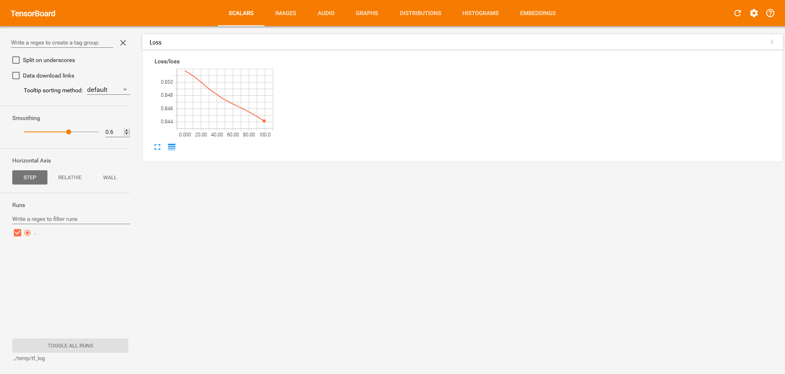
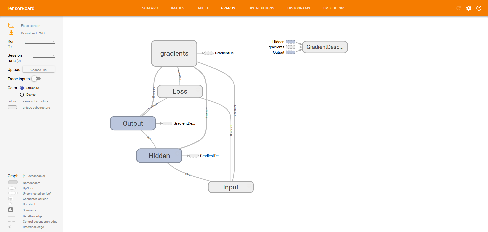

> 2017-03-11 杭州 阴

# 学习tensorflow
## 简介

[tensorflow](https://www.tensorflow.org/)是谷歌发起并开源的一个深度学习
框架，除了搭建神经网络之外还整合了类似scikit-learn的机器学习API。该框架
使用数据流图(data flow graph)来组织神经网络，比较直观，易于上手；并且支
持从云平台到嵌入式设备的多种硬件平台。下面罗列了一些比较重要的特征。

+ 支持windows、linux、mac os 以及android
+ 支持python、c++、java等API接口
+ 有if while等流程控制
+ tensorboard工具将网络图可视化，绘制训练过程中的loss曲线等 

<span id = "安装"></span>
## 安装(windows版)
### 安装依赖环境
1. [CUDA Toolkit](http://docs.nvidia.com/cuda/cuda-installation-guide-microsoft-windows/)
是NVIDIA的GPU计算平台，大概1G多。下载、安装完成后，在_C:\Program Files\NVIDIA GPU Computing 
Toolkit\CUDA\v8.0\bin_下执行_nvcc -V_，查看版本信息。接着打开_C:\ProgramData\NVIDIA 
Corporation\CUDA Samples\v8.0\1_Utilities\deviceQuery_下的VS工程，切换到Release模式下，编译，
得到deviceQuery.exe(在_C:\ProgramData\NVIDIA Corporation\CUDA Samples\v8.0\bin\win64\Release_
目录下)。在控制台下执行deviceQuery.exe，如果结果为**pass**，那么CUDA Toolkit就算安装成功了。
在CUDA Samples文件夹下还有其他的示例工程，也可以编译完运行看看效果，具体介绍参考
[NVIDIA](http://docs.nvidia.com/cuda/cuda-installation-guide-microsoft-windows/)的官方介绍。

2. [cuDNN](https://developer.nvidia.com/cudnn)是NVIDIA的深度神经网络库，其实就是一个很朴实的
API包，下载下来就三个文件.dll、.h和.lib，大小60多M。下载完解压.dll文件所在的目录添加大path环
境变量即可。

### 安装tensorflow
安装gpu版，使用下面的命令

```
pip3 install --upgrade tensorflow-gpu
```

### 测试安装是否成功
写一个python脚本运行一下
```python
import tensorflow as tf
hello = tf.constant('Hello, TensorFlow!')
sess = tf.Session()
print(sess.run(hello))
```

**注意** 默认情况下，tensorflow会输出所有的日志信息，可用下面的方法过滤不必要的信息
```python
import os
os.environ['TF_CPP_MIN_LOG_LEVEL'] = '3'
```

_TF_CPP_MIN_LOG_LEVEL_的取值可以是'0'，'1'，'2'，'3'，对应的功能如下
- '0'：显示所有的日志信息
- '1'：过滤掉'INFO'日志
- '2'：过滤掉'WARNING'日志
- '3'：过滤掉'ERROR'日志

## 使用方法
### 快速入门
搭建一个一维的线性回归网络，代码如下
```python
import numpy as np
import tensorflow as tf

# 一维线性模型y = W*x + b
# W初始值为0.3，b的初始值是-0.3
W = tf.Variable([.3], tf.float32)
b = tf.Variable([-.3], tf.float32)

# 输入训练样本
x = tf.placeholder(tf.float32)
y = tf.placeholder(tf.float32)

# 搭建模型
linear_model = W * x + b

# 定义损失函数
loss = tf.reduce_sum(tf.square(linear_model - y))

# 用梯度下降法优化
optimizer = tf.train.GradientDescentOptimizer(0.01)
train = optimizer.minimize(loss)

# 训练数据
x_train = [1,2,3,4]
y_train = [0,-1,-2,-3]

# 初始化模型参数，即W和b
init = tf.global_variables_initializer()
sess = tf.Session()
sess.run(init) #

# 训练
for i in range(1000):
  sess.run(train, {x:x_train, y:y_train})

# 输出训练结果
curr_W, curr_b, curr_loss  = sess.run([W, b, loss], {x:x_train, y:y_train})
print("W: %s b: %s loss: %s"%(curr_W, curr_b, curr_loss))
```

### 基本概念
#### tensor
tensor是tensorflow组织数据的基本单位，可以看做是多维的数组，一般情况下是二维的矩阵
下面看一下Python中的数组与tensor之间的对应关系
```python
3 # 标量，shape属性是[]
[1. ,2., 3.] # 向量，shape属性是[3]
[[1., 2., 3.], [4., 5., 6.]] # 矩阵，shape属性是[2, 3]
[[[1., 2., 3.]], [[7., 8., 9.]]] # 高维数组，shape属性是[2, 1, 3]
```

#### placeholder
是tensor的一种，用于从外部输入数据。使用的格式如下
```python
#待输入的样本，样本是2维的，None表示样本的数量根据输入自行确定

X = tf.placeholder(tf.float32, [None, 2])
#待输入的标签数据，一位的，None表示标签的数量根据输入自行确定
y_true = tf.placeholder(tf.float32, [None])
```

#### Variables
也是一种tensor，用于存储训练过程中的参数，维数是固定的，使用方法如下
```python
#使用的是2行10列的矩阵
hidden_weight = tf.Variable(tf.random_normal([2, 10]))
hidden_bias = tf.Variable(tf.random_normal([10]))
```

**特别提醒** 一定要用随机数初始化Variable，如果全部初始化为0，训练后很可能
得到的都是NaN。

#### Session
用来运行tensor，并返回tensor的运行结果。在Session运行tensor之前，关于tensor的操作都是定义
网络结构，并没有执行(包括前面定义Variable的random_normal操作)。
```python
sess = tf.Session()
sess.run(tf.global_variables_initializer())
los = sess.run(loss, feed_dict={X:X_data, y_true:y_data})
```

有两个地方需要注意；第一，在运行定义好的网络结构之前，要初始化所有的Variable(也就是第二行
代码)，没有初始值，网络是无法运行的；第二，网络中有输入值，应当通过**feed_dict**这个参数传
入。运行网络后，返回运算结果los。

#### 激活函数
也就是神经网络中的激活函数，定义在[tf.nn](https://www.tensorflow.org/api_docs/python/tf/nn)
模块中，包含了常用的激活函数，比如relu、softmax和sigmoid，用法也很简单。
```python
layer1 = tf.nn.relu(tf.matmul(X, hidden_weight) + hidden_bias)
```

#### Optimizer
用于求解神经网络，在[tf.train](https://www.tensorflow.org/api_docs/python/tf/train)模块。一般
使用[GradientDescentOptimizer](https://www.tensorflow.org/api_docs/python/tf/train/GradientDescentOptimizer)
也就是梯度下降算法。用法如下。
```python
#传入的参数是学习速率
opt = tf.train.GradientDescentOptimizer(0.01)

#train传入sess.run，即可得到loss值
train = opt.minimize(loss)
```

### tensorboard可视化
tensorboard通过读取tensorflow的日志输出来可视化网络结构和训练过程中的
loss曲线的。运行命令_tensorboard.exe --logdir=../temp/tflog_，然后打开
浏览器，输入[http://localhost:6006/](http://localhost:6006/)即可查看。





要想看到上图的效果，在代码中还要注意两个地方。

第一，给想要查看的tensor节点添加summary。
```python
loss = tf.reduce_mean(loss_all)
#记录loss的输出
tf.summary.scalar('loss', loss)

#...

#添加的所有summary聚合成一个操作
#便于后面用Sessiong运行
merge_sum = tf.summary.merge_all()

#...

#指定summary保存的文件夹
train_writer = tf.summary.FileWriter('../temp/tf_log', sess.graph)

#...
for k in range(100):
	#运行summay并保存
	ms, _, los = sess.run([merge_sum, train, loss], 
			feed_dict={X:X_data, y_true:y_data})
	train_writer.add_summary(ms, k)
```

第二，把网络节点组合起来，方便查看网络图。如下面的代码所示，
将相似的操作组合在同一个name scope下，查看网络图的时候，是以name
scope的视图观看的，如果想看某个name scope下的具体操作，点击展开即可，
十分方便。

```python
with tf.name_scope('Input'):
	X = tf.placeholder(tf.float32, [None, nFeature])
	y_true = tf.placeholder(tf.float32, [None, nLabel])
with tf.name_scope('Hidden'):
	hidden_weight = tf.Variable(tf.random_normal([nFeature, nHidden]))

	hidden_bias = tf.Variable(tf.random_normal([nHidden]))
	layer1 = tf.nn.relu(tf.matmul(X, hidden_weight) + hidden_bias)
```

### 保存、加载训练好的模型
目前还没找到连同网络结构一起保存的方法，只能用于保存训练好的参数。
保存的方法很简单，代码如下
```python
saver = tf.train.Saver()
#会在temp文件夹下生成nn_model.meta、
#nn_model.index和nn_model.data-00000-of-00001
#三个文件
saver.save(sess, '../temp/nn_model')
```

加载保存下来的参数
```python
saver = tf.train.Saver()
#这里就相当于把前面定义的模型的参数
#初始化了
saver.restore(sess, '../temp/nn_model')

#注意这里的loss、X和y_true都是前面代码定义好的
#并非从保存的数据中恢复得到。
print(sess.run(loss, feed_dict={X:X_data, y_true:y_data}))
```

### 综合起来
下面是一个三层的神经网络，42维特征，14维标签，隐含层有10个神经元。

```python
import tensorflow as tf
import pandas as pd
import numpy as np
import os

def load():
	feature = pd.read_csv('../temp/test_features.csv', 
			dtype=np.float)
	label = pd.read_csv('../temp/test_labels.csv', 
			dtype=np.float)
	return (feature.values, label.values)
def main():
	nFeature = 42
	nLabel = 14
	nHidden = 10
	X_data, y_data = load()
	with tf.name_scope('Input'):
		X = tf.placeholder(tf.float32, [None, nFeature])
		y_true = tf.placeholder(tf.float32, [None, nLabel])
	with tf.name_scope('Hidden'):
		hidden_weight = tf.Variable(tf.random_normal([nFeature, nHidden]))
	
		hidden_bias = tf.Variable(tf.random_normal([nHidden]))
		layer1 = tf.nn.relu(tf.matmul(X, hidden_weight) + hidden_bias)
	with tf.name_scope('Output'):
		#注意用随机数初始化参数
		output_weight = tf.Variable(tf.random_normal([nHidden, nLabel]))
	
		output_bias = tf.Variable(tf.random_normal([nLabel]))
	
		layer2 = tf.nn.relu(tf.matmul(layer1, output_weight) + output_bias)
	with tf.name_scope('Loss'):
		abs_sub = tf.abs(layer2 - y_true)
		abs_add = tf.abs(layer2 + y_true)
		loss_nan = tf.truediv(abs_sub, abs_add)
		
		#生成和loss_all一样大小的tensor
		zeros = tf.matmul(X, tf.zeros([nFeature, nLabel]))
		#因为前面有除法操作，用于去除生成的NaN数据
		loss_all = tf.where(tf.is_nan(loss_nan), zeros, loss_nan)
		loss = tf.reduce_mean(loss_all)
		tf.summary.scalar('loss', loss)
	opt = tf.train.GradientDescentOptimizer(0.01)
	train = opt.minimize(loss)
	merge_sum = tf.summary.merge_all()
	
	with tf.Session() as sess:
		#训练过程可视化
		if os.path.exists('../temp/nn_model.meta'):
			saver = tf.train.Saver()
			saver.restore(sess, '../temp/nn_model')
			print(sess.run(loss, feed_dict={X:X_data, y_true:y_data}))
			return
		train_writer = tf.summary.FileWriter('../temp/tf_log', sess.graph)
		sess.run(tf.global_variables_initializer())
		for k in range(100):
			ms, _, los = sess.run([merge_sum, train, loss], 
						feed_dict={X:X_data, y_true:y_data})
			train_writer.add_summary(ms, k)
			print(los)
			if los < 0.09:
				break 
		saver = tf.train.Saver()
		saver.save(sess, '../temp/nn_model')
#
if __name__ == '__main__':
	os.environ['TF_CPP_MIN_LOG_LEVEL'] = '3'
	main()
```

### 更多内容
矩阵运算、流程控制等，后续会慢慢添加
