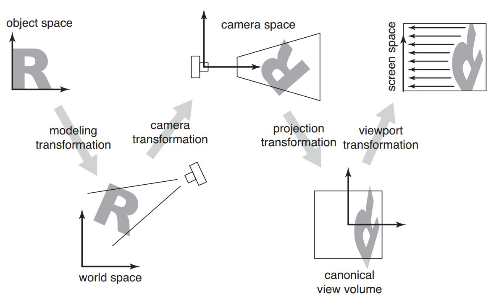
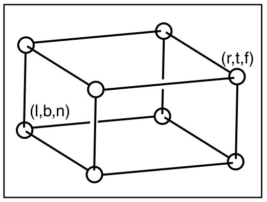
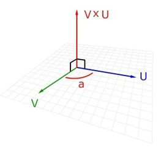
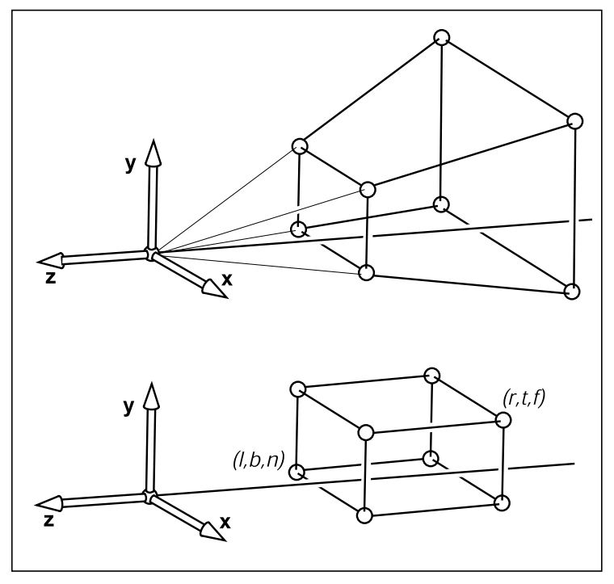
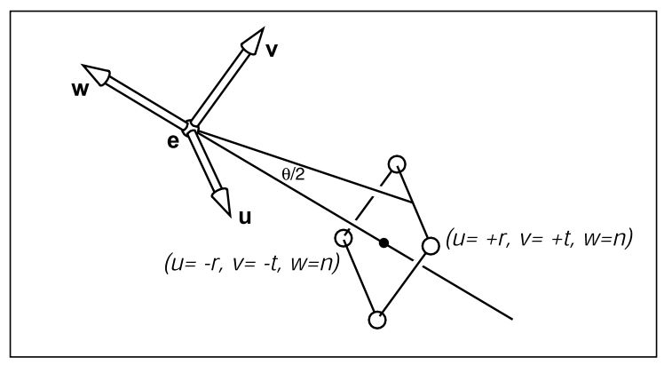

# 投影变换矩阵
理清从对象空间到屏幕空间的整个变换流程，包括中间变换公式的理解。

## 术语表
- 对象空间，object space
- 世界空间，world space
- 相机空间，camera space，eye space
- 裁剪空间，标准视见体，clip space，canonical view volume，normalized device coordinates
- 屏幕空间，screen space，pixel coordinates
- 正投影，orthographic projection
- 透视投影，perspective projection

## 空间变换关系

*说明* 投影变换将相机空间里的点映射到$$[-1, 1]^3$$的裁剪空间，所有映射后不在这个区间
里的点都会被裁剪掉。透视投影先将自己的视见体(view volume)变换成正交投影的视见体，然后再
统一使用正交投影的变换矩阵将视见体里的点变换到裁剪空间。

## 细节
### 标准视见体到屏幕的变换
就是将$$[-1, 1]^3$$映射到[0, nx]$$\times$$[0, ny]，nx、ny分别是水平和垂直方向上的像素数量。
容易得到变换矩阵如下：

$$M_{vp} = \left[ 
\begin{matrix}
\frac{nx}{2}&0&0&\frac{nx}{2} \\
0&\frac{ny}{2}&0&\frac{ny}{2}\\
0&0&1&0\\
0&0&0&1
\end{matrix} 
\right]$$

**Note**：z坐标的数值保留下来了，用于后续的深度检测及其他操作。

### 正投影
首先定义正投影的视见体，如下图：

其中t、b、l、r、f和n分别定义了上下左右以及远近6个平面，因为该视见体位于z轴的负方向，所以n > f。

使用下面的矩阵将正投影的视见体变换成标准视见体：

$$
M_{orth} = \left[
\begin{matrix}
\frac{2}{r-l} & 0 & 0 & -\frac{r+l}{r-l}\\
0 & \frac{2}{t-b} & 0 & -\frac{t+b}{t-b}\\
0 & 0 & \frac{2}{n-f}& -\frac{n+f}{n-f}\\
0 & 0 & 0 & 1
\end{matrix}
\right]
$$

简单介绍一下上面的矩阵是如何计算出来的。考虑x轴上的映射，将l映射到-1，r映射到1，线性映射的参数分别是$$\alpha$$和$$\beta$$，可得如下的方程组：
$$
\begin{cases}
\alpha \cdot l + \beta = -1\\
\alpha \cdot r + \beta = 1
\end{cases}
\Longrightarrow
\begin{cases}
\alpha = \frac{2}{r - l}\\
\beta = -\frac{r+l}{r-l}
\end{cases}
$$
其他几个参数的计算方式同理。

**Note**: 变换之后，所有不在标准视见体里的点都会被裁减掉。

### 相机变换
#### 相机参数
指定相机需要三个参数：
- 眼睛的位置e
- 眼睛看的方向g
- view-up向量t。直观的讲，垂直平分以双眼为两端的线段有一个平面，t就是这个平面上的一个向量。之所以需要它，是因为当e和g固定后，当绕着g旋转头部，看到的图像就不一样。加上t之后，就可以唯一指定这种旋转。

#### 叉积和右手坐标系
注意叉积不满足交换律，即$$a \times b = - b \times a$$。计算公式如下：

$$\begin{aligned}
a \times b &= (a_x, a_y, a_z) \times (b_x, b_y, b_z)\\
&=(a_yb_z - a_zb_y, a_zb_x - a_xb_z, a_xb_y - a_yb_x)\\
&= det\begin{vmatrix}
i&j&k\\
a_x&a_y&a_z\\
b_x&b_y&b_z
\end{vmatrix}
\end{aligned}$$

图片表示的关系如下：

右手坐标系，拇指、食指、中指依次是X、Y、Z。

**Note**: 计算$$a \times b$$时，中指指向a的方向，拇指指向b的方向，则食指指向结果的方向。

#### 构建相机坐标系
根据相机的三个参数，可以把相机的坐标系计算出来，主意此时三个坐标轴上的单位向量是在世界坐标系下表示的：
$$
\begin{aligned}
w &= -\frac{g}{\|g\|}, 对应于z轴\\
u &= \frac{t \times w}{\|t \times w\|}, 对应于x轴\\
v &= w \times u, 对应于y轴
\end{aligned}
$$

我们需要的是将世界空间里的点变换到相机空间的矩阵$$M_{world\rightarrow cam}$$，直接求，不好求。但容易求得将相机空间里的点变换到世界空间的矩阵$$M_{cam\rightarrow world}$$。有如下关系：

$$M_{world\rightarrow cam} = M_{cam\rightarrow world}^{-1}$$

容易得到：

$$\begin{aligned}
M_{cam\rightarrow world} &= \begin{bmatrix}
u&v&w&e\\
0&0&0&1
\end{bmatrix}\\
\\
&= 
\begin{bmatrix}
x_u&x_v&x_w&x_e\\
y_u&y_v&y_w&y_e\\
z_u&z_v&z_w&z_e\\
0&0&0&1
\end{bmatrix}\\
\\
&= 
\begin{bmatrix}
1&0&0&x_e\\
0&1&0&y_e\\
0&0&1&z_e\\
0&0&0&1
\end{bmatrix}
\begin{bmatrix}
x_u&x_v&x_w&0\\
y_u&y_v&y_w&0\\
z_u&z_v&z_w&0\\
0&0&0&1
\end{bmatrix}

\end{aligned}
$$

因为
1. $$(AB)^{-1} = B^{-1}A^{-1}$$
2. $$A^{-1} = A^T, A是正交阵$$
3. $$\begin{bmatrix}A&0\\0&1\end{bmatrix}^{-1} = \begin{bmatrix}A^{-1}&0\\0&1\end{bmatrix}$$
4. $$\begin{bmatrix}u&v&w\end{bmatrix}$$是正交阵

所以得到
$$\begin{aligned}
M_{world\rightarrow cam} &= \begin{bmatrix}
x_u&y_u&z_u&0\\
x_v&y_v&z_v&0\\
x_w&y_w&z_w&0\\
0&0&0&1
\end{bmatrix}
\begin{bmatrix}
1&0&0&-e_x\\
0&1&0&-e_y\\
0&0&1&-e_z\\
0&0&0&1
\end{bmatrix}
\end{aligned}
$$

### 透视投影
透视投影的思路比较简单，现将透视投影的视见体映射成正投影的视见体，之后的操作就和正投影一样的，见下图：

变换矩阵如下：

$$P = \begin{bmatrix}
n&0&0&0\\
0&n&0&0\\
0&0&n+f&-fn\\
0&0&1&0
\end{bmatrix}
$$

**Note**: 对任一点有下面的变换。相乘的结果将第四维归为1才是最终的位置。

$$P\begin{bmatrix}
x\\y\\z\\1
\end{bmatrix}
=
\begin{bmatrix}
nx\\ny\\z(n+f)-nf\\z
\end{bmatrix}
\sim
\begin{bmatrix}
\frac{nx}{z}\\\frac{ny}{z}\\n+f-\frac{nf}{z}\\1
\end{bmatrix}
$$

#### 为什么是这样的矩阵？
在透视变换中需要根据z值按比例缩小其他坐标，但是单纯使用$$x \rightarrow Mx$$并不能达到这个目的。所以扩展了齐次坐标的功能，经过透视投影变换后，所有坐标同时除以第四维，化为正常坐标。

但扩展后又引入新的问题，如何保证z坐标不变(之后的深度测试要用)？$$\frac{a\cdot z+b}{z}$$这种形式的计算没办法保证z不变。所以退了一步，保证视见体内部点的z坐标相对大小不变。所以就用了$$n+f-\frac{nf}{z}$$(定义域和值域不变，改的是映射方式)。直观上讲，P矩阵的功能就是把图中上面的视见体压缩成下面的视见体，并且原来在外面的点压缩后仍然在外面。

#### 简化版
对透视投影做些常见的限制：
1. 眼睛在视见体的中心轴上，即：
    &nbsp;&nbsp;&nbsp;&nbsp;$$l = -r, b = -t.$$
2. r和t的比率符合显示器长宽像素比，以免显示图像的时候出现变形：
    &nbsp;&nbsp;&nbsp;&nbsp;$$\frac{n_x}{n_y} = \frac{r}{t} \equiv \alpha$$
3. 使用field-of-view(见下图)，并且有$$tan\frac{\theta}{2} = \frac{t}{|n|}$$
    

那么只需要给定$$n, f, \theta$$以及长宽比$$\alpha$$这四个参数，其他参数即可得出，进而可得$$P$$和$$M_{orth}$$

$$
\begin{cases}
t &= |n|tan\frac{\theta}{2}\\
b &= -t\\
r &= \alpha t\\
l &= -r
\end{cases}
$$

### 绘制算法
1. 计算$$M_{vp}$$
2. 计算$$M_{orth}$$和$$P$$
3. 计算$$M_{world\rightarrow cam}$$
4. $$M = M_{vp}M_{orth}PM_{world\rightarrow cam}$$
5. for each line segment($$a_i$$, $$b_i$$) do
    1. $$p = Ma_i$$
    2. $$q = Mb_i$$
    3. drawline($$x_p/w_p, y_p/w_p, x_q/w_q, y_q/w_q$$)

----
参考：Fundamentals of Computer Graphics, 3rd edition

