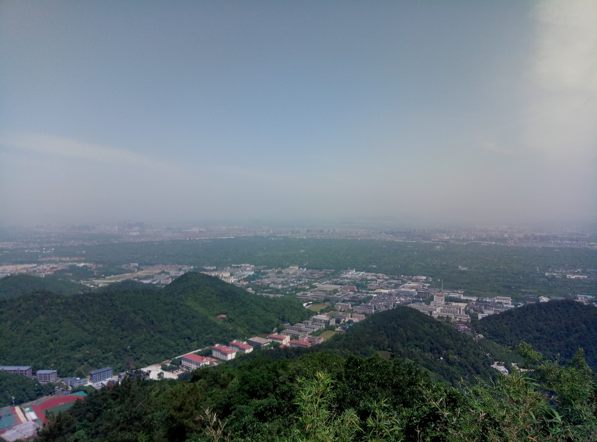
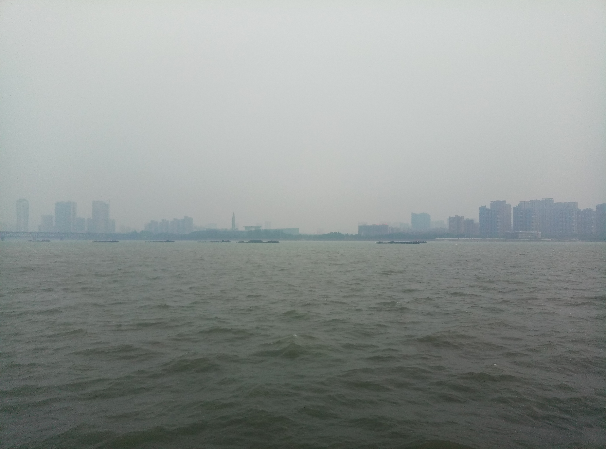

# 17年春季毅行
> 2017年5月14日，杭州，晴

刚开始并没有打算去，不过后来三个室友都去，自己想想反正也没有其他安排，就跟着去了。

总体来说，这次毅行的体验要好很多，主要是大家都相互认识，两个队长也给力，所以整个过程比较轻松愉快。上午大概八点半从图书馆后面出发，下午两点半左右到达之江正门，历经六小时，共16.5千米。

除了出发点和终点，途中还有两个盖章的地方，分别在北高峰和法喜寺。

从老和山到北高峰这段路，有几个地方非常适合俯瞰杭州城，中间是一大片森林，外围天边却是一层高楼大厦，景象蛮特别的。

俯瞰杭州

北高峰那个点儿有个透风的水泥房可以休息，支路走过去还有个卫生间。北高峰到法喜寺这段路倒是没什么特别的印象，不过快到法喜寺的时候要下山，当看到一个像寺庙的地方时并没有到，还要翻过一段阶梯才能到达法喜寺的正门。

在法喜寺吃斋饭的人比较多，不好找位置，一个组人多的话，最好分开坐，吃完饭再集合。饭菜不多，有可能吃不饱，最好自己带点零食或者再买一份。食堂门口前面有水池，左边有卫生间，人比较多，可能需要排队。

从法喜寺出来，跟着毅行的路标，要爬一段很长的阶梯，上去后是一个茶场，视野很开阔，风景也不错，很适合拍照。不过这段路并不长，走不了几分钟，就要沿着茶场下山了。

茶园

下山的毅行队伍

下山后就是龙井村，像是个区民区，可以在这个地方买点零食和饮料。龙井村走不了多久就到了九溪十八涧，这段路其实没什么风景，就是截断公路的溪流比较多，人多的话，需要排队过溪流。九溪十八涧拍cosplay的比较多，也算是一道风景。这段路树荫就比较多，不怕太阳晒了。这段路要走一些时间，之后就从之江校区正门进去达到终点，扫码签到，领取纪念品就ok了。

在终点拍完纪念照11个人就在草坪上玩了一下午的狼人杀，虽然自己很菜，每把都死得早，但玩得很开心，有大神带队，一把结束后都非常激动地分析整个过程。大概五点半从正门出去，走左转的那条支路坐318区间回去(注意地图上搜的路线要远一些，走支路前面有条斑马线，对面就是公交站。另外，这趟车晚的话容易错过末班车；还有一点，浙大附中下车后有两个方向，一个去正门，一个是新桥门)。

毅行徽章

毅行过程中还有一些需要注意的细节，准备两瓶水，一瓶矿泉水，一瓶运动饮料，吃的带两根士力架(提前买好，途中就吃完，不然会化掉)。不要穿牛仔裤，太紧了，爬山不方便。多带点手帕纸，擦汗、洗脸都用得着。百度地图记录旅游路线，中途容易断，走到法喜寺突然断掉了，而且什么记录和提醒都没有，当时真想把手机砸了，以后记路线，换个靠谱点儿app。

坚持6小时走完16.5km，其实并没有多难受，走到后面就适应了，接下来几天可能双腿不适，其他并不会有什么大碍。千里之行，始于足下！现实中的很多事，并不需要很高的智力和过人的体力，笃定目标，持续付出，看起来遥不可及的目标，总有走到的一天！

之江校区正门前的江面

