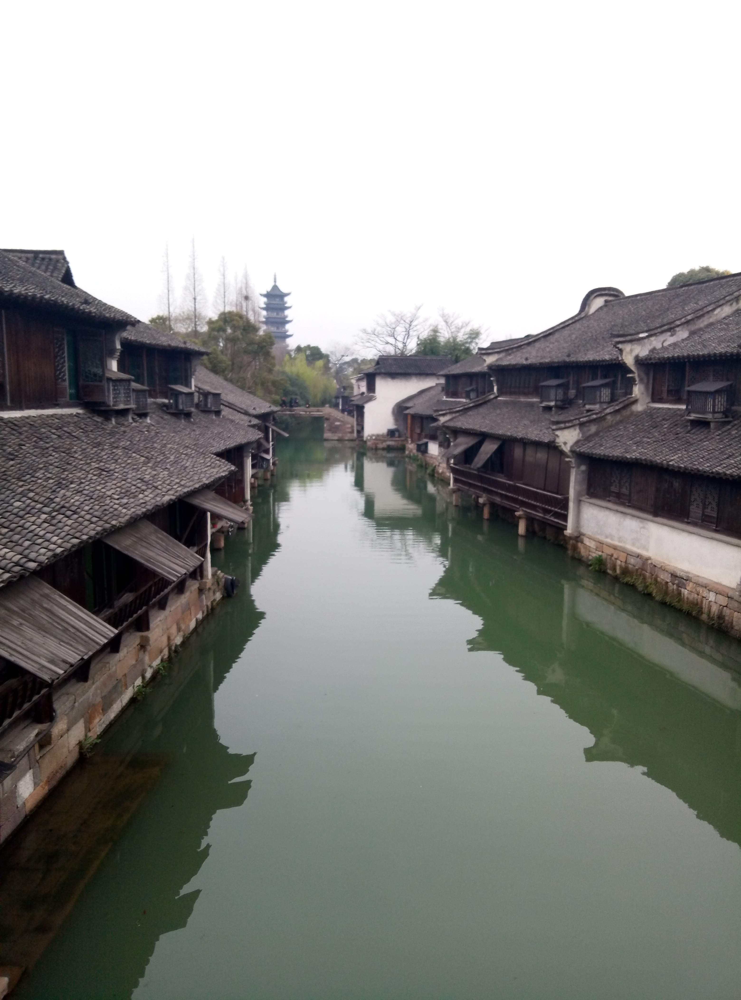
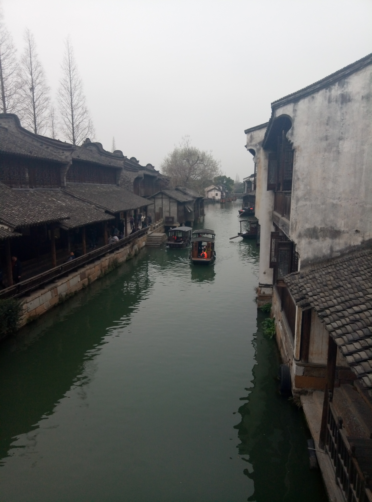
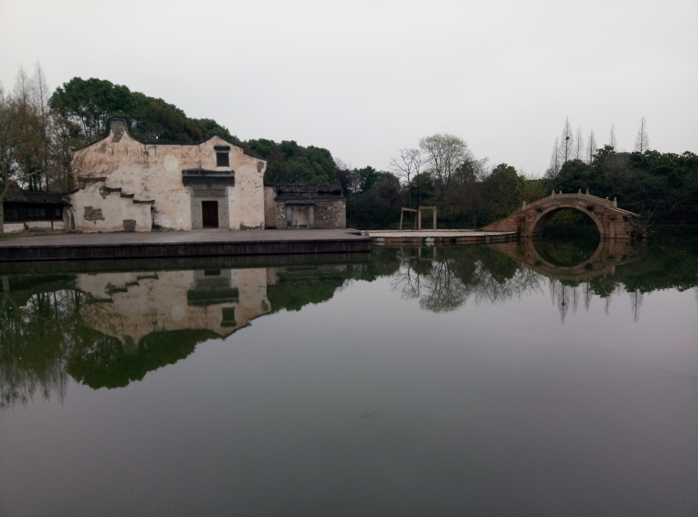
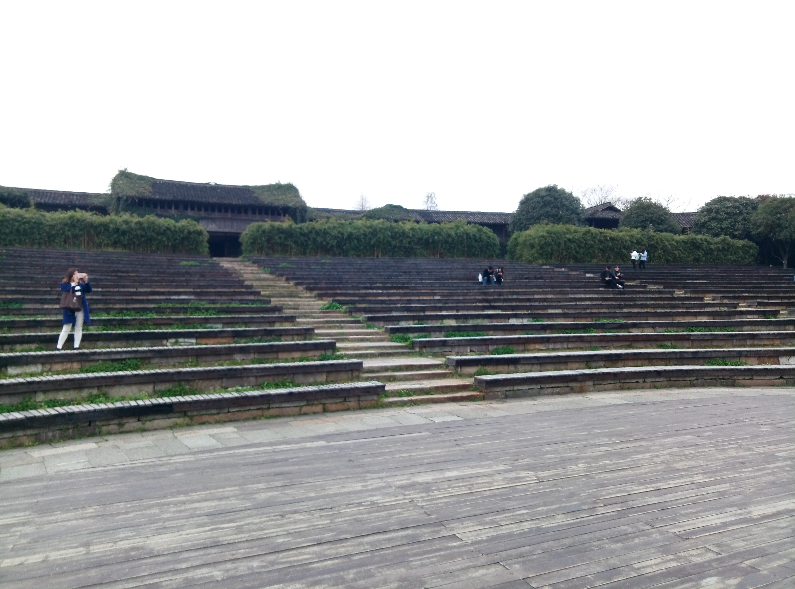
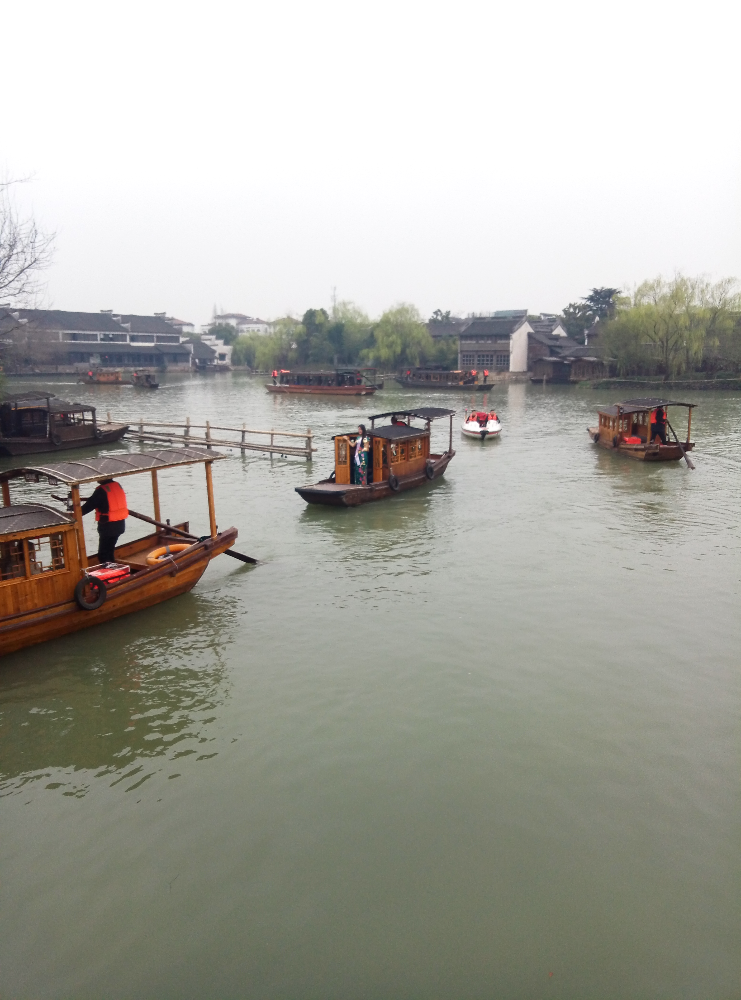

# 乌镇旅游
> 2017-03-18，阴

最开始想去，是因为之前没去过这样的江南水乡，有一种神秘、朦胧的吸引力。但清早的小雨，使自己的突然对这趟行程有了厌倦感。

坐在车上，不想聊天、不想玩手机，对接下来的旅游也没有太多期待，百无聊赖地看着窗外的杭州，可能是很久没出校门了，觉得杭州的街道和两旁的楼房都非常干净、整洁，看着很舒服，有一种现代化大都市的气质，接着感慨，毕业后要留下来。

一个半小时的车程，到了买完票队伍就散了，我们四个男生临时凑在一块儿，也没什么旅游规划，就随着人流观光。

天气有些阴沉，不过恰好适合游览这种水乡小镇，拍出来的照片效果比较好，给人一种清幽、静美的感觉。东栅这边基本上都是小巷子，人比较多，在狭小的巷子里，如果赶上一个旅游团经过，会被迫挤着往前走。我们打算进一个宅子参观，结果游客从门口一个接一个的出来，我们愣是没挤进去，无赖退回去从另一个入口进去。

其实河道两边的风景还是蛮不错的，特别是站在石桥中央沿着河面眺望，黑瓦白墙、绿水垂柳，再加上顺流而下的木舟，拿起手机，随手一拍就可以定格一张完美的风景画。

江南水乡景色

不过需要提出的一点是河水看着有点脏，有些浑浊，不过西栅要好很多，所以拍出来的照片效果也要好。

水上木舟

中午在五芳斋吃饭，点了一份28元的招牌面，味道还行，面汤比较好喝。这家五芳斋和之前在武汉吃的一家有些差别，小吃的种类比较少，基本上都是主食。

下午在西栅逛，主要是古宅，有纺织染布的，有剧院影院，还有过去的婚房和嫁妆，有个老式的剧院还是蛮不错的，舞台和观众席之间隔着一湖水，观众席也是台阶式的，十分宽敞，想想在晚上隔着湖水看远方灯火处的舞台，也是蛮有趣味的。

剧院-舞台

剧院-观众席

一行人在婚房逗留了一会儿，付些钱，是可以穿上旧式的红衣婚服，女生甚至可以补些妆，更像是真实的婚礼。生意蛮好的，小小的洞房挤了好几对新郎、新娘。

景区的古宅，有些有人住，有些是空房，走在巷子里，甚至可以窥看到本地人的生活。不过有一点不能理解，一群人围着整理蚕丝的大妈是为何，大妈旁若无人的整理这手中的活，旁边的人满是好奇地盯着看，还有拿着专业相机对着拍的，看得我都有些尴尬。

每玩一个景区，都买一件纪念品的愿望落空了，转了好几家，都没有让自己眼前一亮的东西，太贵的东西，自己欣赏不了、也买不起，其他的小东西，虽然价格比外面贵很多，但给人的感觉就是粗制滥造的廉价品，都给人一种刻意迎合人的媚俗感。唯一不错的是一个木制的杯子，58块，很轻，手感不错，也是自己欣赏的那种简洁风格，不过当时犹豫了一下没买，现在想起来有点小后悔。

出景区前在一家奶茶店休息了一会儿，点了杯20元的橙汁，味道实在不敢恭维，甚至尝不到橙汁的味道，感觉是用的是放了很久没有什么水分的橙子。三点左右就回车上了，接下来的两个小时就在车上刷手机度过了。

整体来说，这是次不惊不喜的旅游，没有什么期待、也没有什么惊喜。个人觉得旅游前应当做好攻略，玩哪些景点、吃哪些美食，提前有个规划能节省不少精力。另外，一个人或者熟悉好友一起旅游的体验会更好，彼此间默契，相处时更自我些。

礼仪船队
