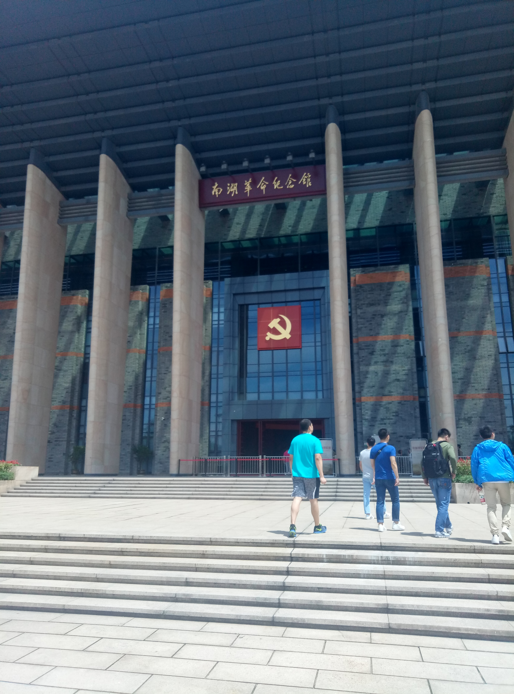
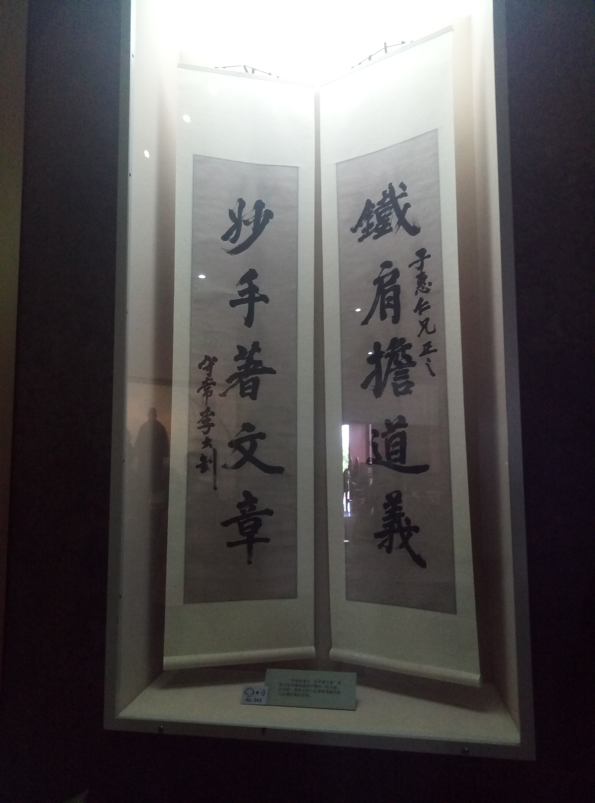

# 嘉兴南湖
> 2017年5月13日，杭州，晴

本来是想要个清闲的周末，不过知道南湖是中共一大会议地点后，就改变
注意了，毕竟是教科书上提到的地方，亲身去看一看还是很有必要的。

车子刚进入嘉兴市城区，看到的就是一片片新建的高楼，整体感觉是比较
现代化的，街道周围也很干净。不过来往的车辆比较少，听室友讲这是新城区，
刚开发出来不久，所以人流量不大。

南湖革命纪念馆看起来挺大气的，进去参观要身份证，还要安检，不允许带水，
就两个安检员，有点忙不过来，人都堵在门口了。

南湖革命纪念馆

整个纪念馆算是把近现代史讲了一遍，从清末一直讲到当下。不过博物馆这种叙事
方式要比书上好多了，照片、实物、蜡像、视频，还有还原出来的场景，这种身临其境
的感觉还是蛮有震撼力的。特别是五四运动那一块儿，好多人名、报刊、文章都非常耳熟，
毕竟当年背书挺用功的，虽然现在记得不清，但是念到前几个字，嘴上会自然地补出后面的
字。

红船模型

看到李大钊的事迹还是有些感触，以前以为他最后得以善终，今天才知道他38岁时受绞刑就义。
墙壁的左边是他的照片、手稿、题字等遗物，墙壁的右边是一个阴暗、恐怖的绞刑架(复原物)。
往后退一点，将整面墙收入眼底，李大钊的一生就在眼前，前后的对比还是挺震撼的。

铁肩担道义，妙手著文章

下午去月河玩了一个半小时，和乌镇一样，也是几条古街，不过规模要小一些。里面的景物都大同小异，
店铺也比较多，简单地转转还可以。比较有趣的地方是那条花鸟市场的古街。以前没近距离见过
这些宠物，今天看到了，感觉好奇特。松鼠的爪子居然是五指分开的，站起来的姿势很像电影里的
怪兽。鹦鹉看起来特别有趣，个性十足的嘴巴，一对眼睛圆圆地睁着，你盯着它看，它若无其事，
一点眼神交流也没有。后面还有两家水族馆，各种特色的鱼，也蛮有意思的。其实想想，以后有自己
的地方了，养几个这样有趣的宠物，也是蛮有意思的。

整个游玩过程也就几处让自己眼前一亮、有所触动的地方，为了这几处花了一天的时间，看起来好像
不划算，但生活就是这样的，正是那处耀眼的地方照亮了整个旅游。
