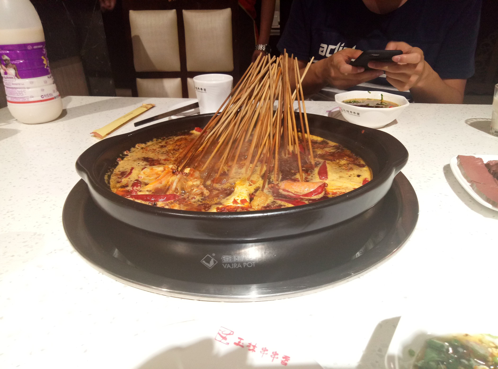

# 成都游玩
> 2017年7月9日

借着参观成都军工所的机会，又一次体验了这个有天府之国美称的城市。
## 美食
不得不说成都的小吃既丰富又美味，价格实惠，分量又足。对我这种快适应了杭州那边口味的人来说，
更有特别的吸引力。

冰粉，天奥宾馆右边那条小街上的夜宵店

串串

开胃菜

大味生态火锅，有个老豆腐的菜还不错

甜水面，在春熙路一个小巷子里吃的，味道一般

玉林串串，四威苑宾馆对面

## 美景
### 金沙遗址博物馆

金沙遗址博物馆，门票80，学生卡半价

太阳神鸟，镇馆之宝，也是成都的城市标志

### 三星堆博物馆

三星堆博物馆，门票80，学生卡半价

面具，有很多，小的有指头那么大，大的和成人差不多高，样式也是多种多样

面具

青铜纵目面具

青铜纵目面具

太阳轮

### 四川大学

四川大学

### 西南交通大学

四川大学

### 春熙路

春熙路

