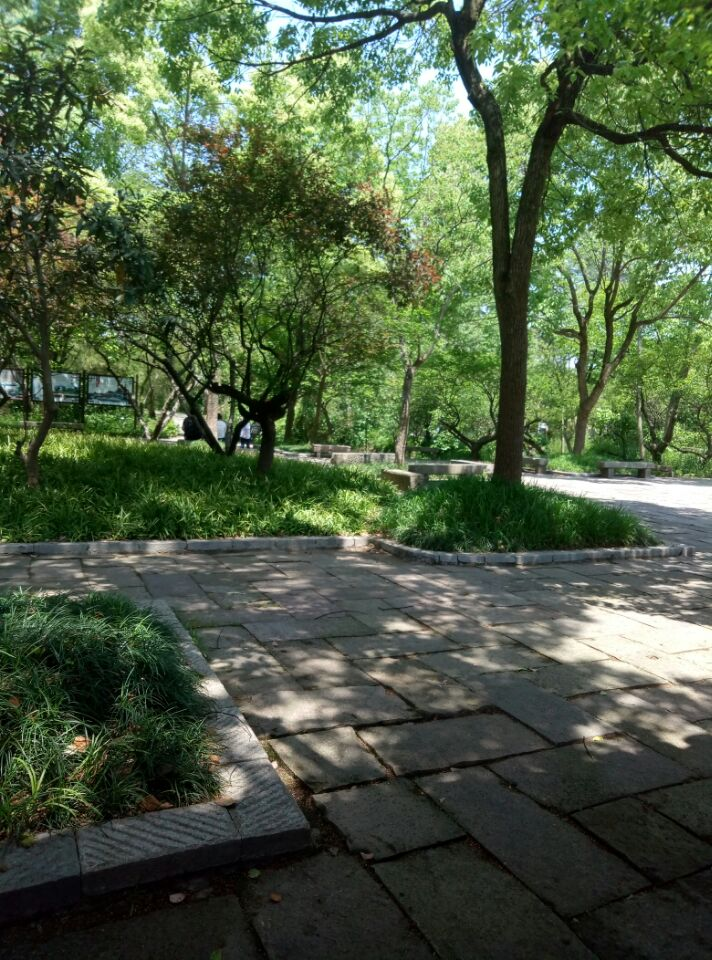
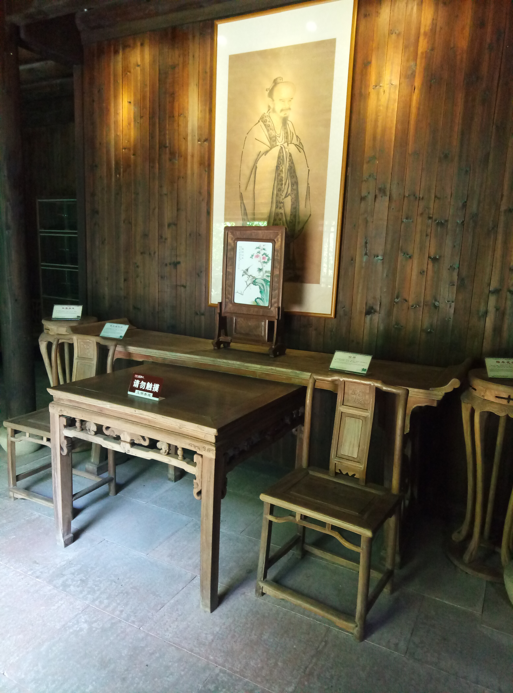
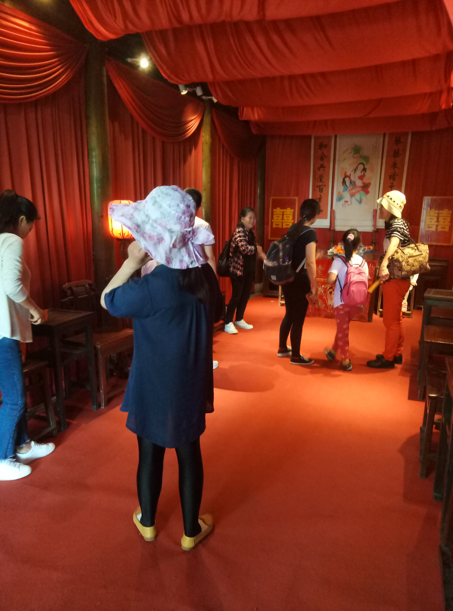

# 西溪湿地
> 2017年4月29日，杭州，晴

身边的朋友一直安利西溪湿地，但自己来杭州一年多了，荒废了
无数个周末，也没有去这个只有几步路的景点。一次偶然的机会，
看到地图上的西溪湿地，大片分散的水域，与周围的区域截然不同，
一下子吸引了自己，觉得有必要亲身体验下这个地方。五一假期第
一天，寝室四个人刚好都有空，就约着一起去逛逛。

从古荡公交站到西溪湿地，三站路，差不多半个小时就到了。上午
10点多，售票处的游客并没有我们想象的那么多，很容易就买到票了。
成人票80元，如果坐游船的话，另加60。整个收费景区被一条人造河
环绕起来了，坐游船观光的话，确实很方便，而且允许下船游览。不过
四个人都是穷屌丝，不想再多掏60块，安慰自己徒步观光更自由。

这里的植被覆盖率很高，走在里面就像在林间小路穿梭一样，再加上
偶尔来两声悠远的鸟叫声，很有感觉。一个很有意思的地方是景区内
遍布落地音箱，放着舒缓的轻音乐，给人的感觉是在经历一个虚拟的
场景，耳边配的是背景音乐。

夏天的感觉

西溪水阁那一块儿有好几个独立的古式的木房，两层结构，第一层应该
是大厅，摆的有八仙桌、太师椅，还有屏风之类的家具。不知道古人住
的房子确实是这样，还是因为仿造缩小了比例，感觉室内空间比较狭小，
家具之类对我们来说也显得有些小家子气。这些单独木房一般配有卫生间，
确实很方便游客，不过有一点要吐槽一下，卫生间的窗口朝向游客来往的
道路，小便池也在那一块，其中的尴尬自行体会。

木房内的厅堂

梅竹山庄那一块儿，也可以说是整个景区，小路多，分叉也多，不注意的话，
很容易绕一圈回到原点。所以最好定个目的地，按照路口的指示牌走。四个男
生在里面跌跌撞撞、走不少弯路才走出一个景点。

中午在烟水渔庄吃了碗面，18元，量不多，味道还可以，主要是提供吃饭的位置
还是蛮宽敞的。刚进这个地方的时候，四个人都很饿了，看见不少游客在
啃玉米棒，很是嘴馋，好不容易找到买玉米棒的阿姨，买之前问了一下她，附近
是不是没有吃饭的地方，阿姨很肯定的说，除了她这儿买玉米棒，没有其他吃饭
的地方了，8块钱一根玉米棒，2块一个鸡蛋，四个人都买了一份。出门还没开始
啃玉米棒，就看到好几家饭店，骗子！

码头上的守望者

烟水渔庄入口有一个当地婚俗博物馆，装饰得很喜庆，和其他景区差不多，这个地方
游客比较多，景色也相差不大，我们就没有进去细看，不过种大红装扮出来的喜庆气氛
还是很有感染力的。

喜庆的婚房

下午一两点在蒋村集市慢生活区的一家奶茶店歇脚，每个人点了杯饮料，人均20元左右。
饮料味道一般，主要是提供一个歇脚的地方。坐在路边的遮阳伞下 ，四个人玩了
一个多小时的桌游。

下午绿堤有个花朝节展览，我们就打算从那条路上往回走。绿堤那一块儿和其他地方的风景
确实不一样，很多花，大的，小的，红的，黄的，蛮有百花齐放的感觉。不过在这里人也多，
所以拍照的时候有些不方便。大多数游客携家带口、老少一群人，很是热闹。下面放几张
自己拍的花。

花圃

校庆同款鲜花

不知名的白花

这种游玩或许才是生活的常态吧，说惊艳、惊喜吧，也算不上，就是平平淡淡地
走了一圈，偶尔一些意外的小插曲点缀这趟旅途，让人相信或许前面还有更大
的惊喜等着我们吧！